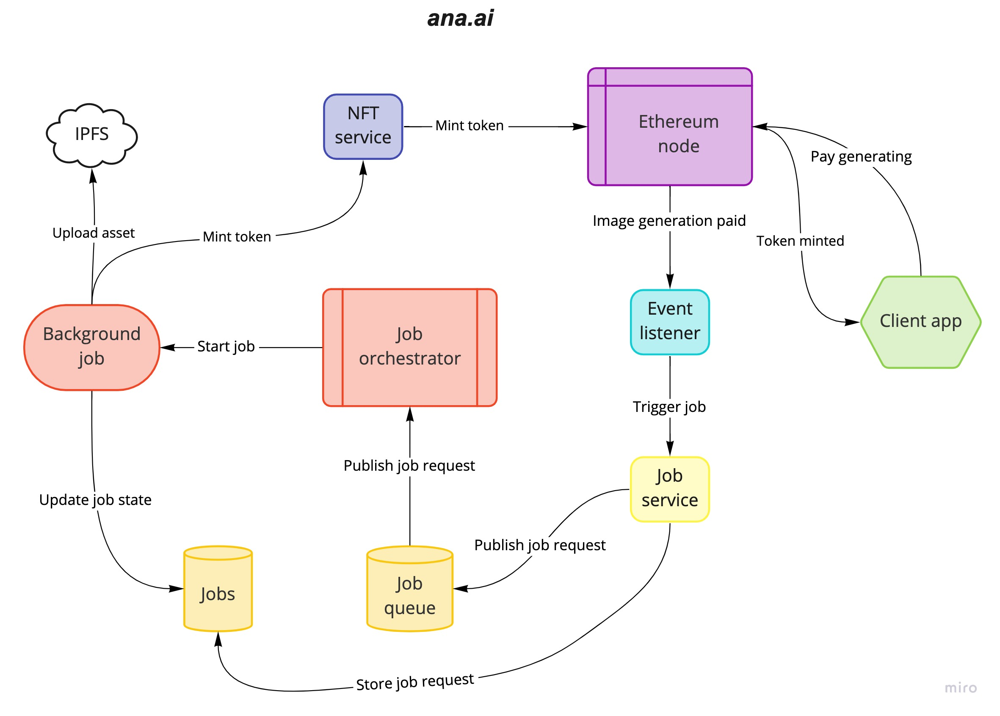

# anaai

[ana.ai](https://anaai.art/) is a generative art platform for creating your own
art as NFTs. The idea is to allow users to create their own art using different
generative mathematical and AI models. It is live on [Polygon](https://polygon.technology/)
and can be found [here](https://app.anaai.art/)!

https://user-images.githubusercontent.com/10870130/151812096-93827fbc-0b19-4bca-8665-bc223137e6a7.mp4

### How it is used:
1. Copy image url you want to transform
2. Accept the transaction in your metamask wallet
3. Enjoy your generated image!

### What happens in the background
1. ana.ai listens for events on Ethereum
2. When an event is received, a background job is triggered
3. After the image is generated, it is uploaded to IPFS and the token is minted
   for you
4. ana.ai emits another event to notify your browser that your image is
   successfully generated

### Platform architecture

### Components
#### Contract
Contract defines what data we want to store on the blockchain and how to
manipulate it. It is based on the [ERC721](https://eips.ethereum.org/EIPS/eip-721)
standard.
For more information, check it out [here](contract/README.md).

#### Event listener
Event listener listens for events on the blockchain and triggers actions int the
platform. When users pay for generating an image, a background job is triggered
that generates the image.
For more information, check it out [here](event-listener/README.md).

#### Job service
Service responsible for triggering background jobs that generate images.
Requests are emmited via the event listener. Job service does the following:
1. Stores the job request
2. Published to redis to trigger a background job
For more information, check it out [here](job-service/README.md).

#### Job orchestrator
Task queue used for running background jobs. Implemented using [Celery](https://docs.celeryproject.org/en/stable/getting-started/introduction.html).
Redis is used as a messaging queue and postgres is used as the result db.
Job orchestrator is subscribed to redis and upon receiving a message starts a
background job that does the following:
1. Generate image
2. Upload image to [IPFS](https://www.pinata.cloud/)
3. Post a mint token request to nft service
For more information, check it out [here](job-orchestrator/README.md).

#### NFT service
NFT service is responsible for all admin transactions for our contract. In this
case, it's only used for minting NFTs for users.
For more information, check it out [here](nft-service/README.md).

#### Client
Frontend application for interracting with the platform. Allows user's to pay
for generating images and shows their gallery of generated images.
For more information, check it out [here](client/README.md).

### Requirements
1. [Metamask](https://metamask.io/) wallet for testing and deploying contracts
2. [Alchemy](https://www.alchemy.com/) for running blockchain nodes and
   interracting via API
3. [Pinata](https://www.pinata.cloud/) for storing images and token metadata
4. Docker and docker-compose

### Setup
1. Deploy contract on Ethereum (or use an existing one)
2. Setup environment variables for services (check .env.example of each service)
3. `docker-compose up build`

### Testing
#### Contract
1. `cd contract`
2. `npm install`
3. `npm test`

#### NFT service
1. `cd nft-service`
2. `docker build -t nft-service .`
3. `docker run nft-service python -m pytest tests`

#### Event listener
No tests yet.

#### Job service
1. `cd job-service`
2. `docker build -t job-service .`
3. `docker run job-service python -m pytest tests`

#### Job orchestrator
1. `cd job-service`
2. `docker build -t job-orchestrator .`
3. `docker run job-orchestrator python -m pytest tests`

#### Client
Not yet runnable through docker:
1. `yarn install`
2. `yarn test`
